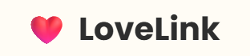
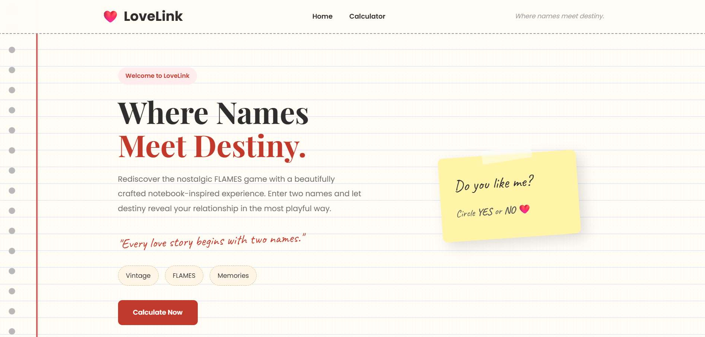
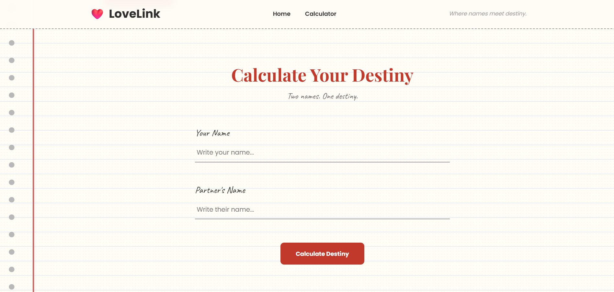
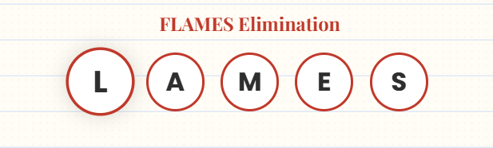
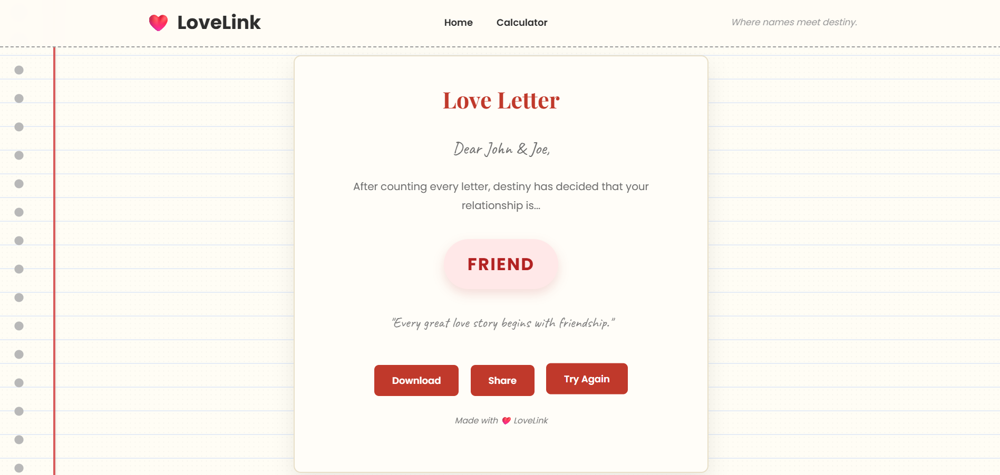

# ❤️ LoveLink - Where names meet destiny.

<div align="center">

### Notebook Inspired FLAMES Relationship Calculator

A beautifully crafted FLAMES calculator with a vintage notebook theme, smooth animations, and an engaging user experience.


</div>

---

# Live Link

<a href="http://lovelink.infinityfree.me/" target="_blank">
  
</a>

---

# About

LoveLink is a modern implementation of the classic **FLAMES relationship game**. It combines nostalgic gameplay with a premium notebook-inspired interface, smooth elimination animations, and a personalized love letter result.

Instead of simply displaying the final relationship, LoveLink visualizes every elimination step, making the experience interactive and enjoyable.

---

# Features

- Notebook-inspired UI/UX
- Exact FLAMES elimination algorithm
- Step-by-step elimination animation
- Real-time form validation
- Personalized Love Letter result
- Download result as an image
- Share result instantly
- Retry calculation
- Fully responsive design
- SEO optimized
- Smooth animations and transitions

---

# Screenshots

### Hero Section


### FLAMES Calculator


### Elimination Animation


### Result Letter


# 🎮 How It Works
1. Enter your name.
2. Enter your partner's name.
3. Click **Calculate Destiny**.
4. LoveLink removes common letters.
5. Remaining letters determine the count.
6. FLAMES elimination begins.
7. The final remaining letter decides the relationship.
8. Download or share your result.

---

# FLAMES Relationships

| Letter | Meaning |
|---------|---------|
| F | Friendship |
| L | Love |
| A | Affection |
| M | Marriage |
| E | Enemy |
| S | Sibling |

---

# Project Structure

```text
LoveLink/
|
├───README.md
├───public
│   │   index.php
│   └───assets
│       ├───css
│       │   │   responsive.css
│       │   │   style.css
│       │   ├───components
│       │   │       buttons.css
│       │   │       calculator.css
│       │   │       cards.css
│       │   │       footer.css
│       │   │       hero.css
│       │   │       navbar.css
│       │   │       result.css
│       │   └───globals
│       │           base.css
│       │           layout.css
│       │           reset.css
│       │           typography.css
│       │           utilities.css
│       │           variables.css         
│       ├───icons
│       │       logo.png
│       └───js
│              animation.js
│              calculator.js
│              download.js
│              flames.js
│              main.js
│              result.js
│              retry.js
│              share.js
│              validation.js              
└───views
    ├───home
    │       index.php
    │       result.php
    │       
    └───layouts
            footer.php
            header.php
            navbar.php

```
---

# Tech Stack

## Frontend

- HTML5
- CSS3
- JavaScript (ES6)

## Backend

- PHP

## Libraries

- html2canvas

## Development Environment

- XAMPP
- VS Code

---

# ⚙ Installation

Clone the repository

```bash
git clone https://github.com/mithilesh-2006/LoveLink.git
```

Move the project into your XAMPP `htdocs` folder.

Start:

- Apache

Visit

```
http://localhost/LOVELINK/public/
```

---

# Responsive Design

LoveLink is optimized for

- Desktop
- Laptop
- Tablet
- Mobile

---

# SEO

Includes

- Meta Description
- Theme Color
- Open Graph Tags
- Twitter Card Support
- Favicon

---

# Performance

- Modular CSS
- Modular JavaScript
- Optimized DOM manipulation
- Minimal dependencies
- Smooth animations

---

# Download Feature

Users can download the generated Love Letter as an image using **html2canvas**.

---

# Share Feature

Share the generated Love Letter directly using the browser's native Share API (supported browsers).

---

# Learning Outcomes

This project demonstrates
- Git and GitHub
- DOM Manipulation
- Modular JavaScript Architecture
- CSS Animations
- Responsive Design
- Form Validation
- Algorithm Visualization
- UI/UX Design
- Frontend Performance Optimization

---

# Future Enhancements

- Dark Mode
- Multiple Themes
- Love Compatibility Percentage
- Zodiac Matching
- Music Effects
- Multi-language Support
- PWA Support
- Save Previous Results
- Personalized Quotes

---

# Author

**Mithilesh P**

Aspiring Software Development Engineer

GitHub:
https://github.com/mithilesh-2006

LinkedIn:
https://linkedin.com/in/mithilesh2006

---

# Support

If you enjoyed this project,

⭐ Star this repository.

It motivates future development.


<div align="center">

### ❤️ Every Love Story Begins With Two Names ❤️

Made with Love by **Mithilesh P**

</div>
